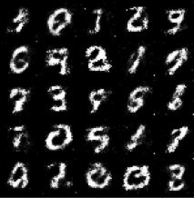
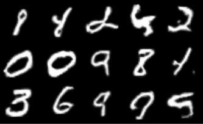

# Deep Convolutional GAN (DCGAN)
A jupyter notebook based implementation of the DCGAN paper from Radford et al. This paper introduced convolutions to GANs which dramatically increased performance. This implementation randomly generates numbers from the MNIST dataset without conditioning. As shown below, DCGAN provides significant benefits over the original fully-connected GAN approach, although more work is still needed to allow for conditional results which can also be controlled.

# Results

## Original GAN


## DCGAN



# Citation
```
Radford, Alec, Luke Metz, and Soumith Chintala. "Unsupervised representation learning with deep convolutional generative adversarial networks." arXiv preprint arXiv:1511.06434 (2015).
```