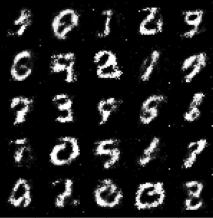

# Generative Adversarial Networks (GAN)
A simple jupyter notebook based implementation of the original paper from Goodfellow et al. which introduced GANs. This implementation randomly generates numbers from the MNIST dataset without conditioning. By modern standards the results generated here are quite bad but provide a good baseline for future improvements (DCGAN, WGAN, etc.).

# Results



# Citation
```
Goodfellow, Ian, et al. "Generative adversarial nets." Advances in neural information processing systems 27 (2014).
```