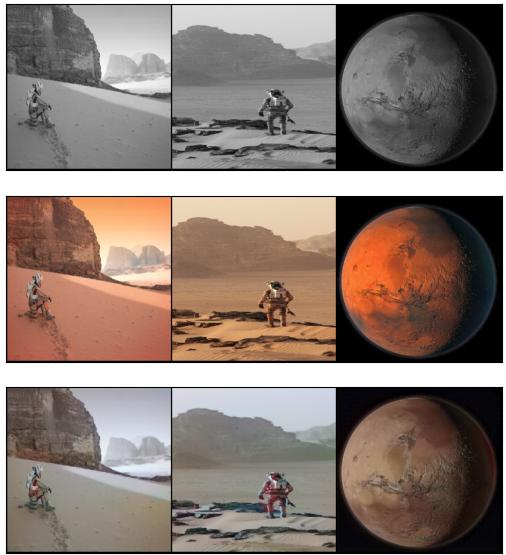

# Pix2Pix
A jupyter notebook based implementation of the Pix2Pix paper from Isola et al. This paper focuses on image to image translation, i.e. receiving an image as input and outputting an image with properties derived from the input image. This paper implemented this technique with the following methodologies:
- UNet architecture for generator
- PatchGAN architecture for critic
- Removed common Z latent vector
- Added L1 loss to traditional GAN loss to encourage color and reduce visual artifacts

This implementation applies Pix2Pix to colorizing grayscale images.

# Results
Legend: Top - Grayscale Input, Middle - Original, Bottom - Colorized Output



# Paper
## Abstract
We investigate conditional adversarial networks as a
general-purpose solution to image-to-image translation
problems. These networks not only learn the mapping from
input image to output image, but also learn a loss func-
tion to train this mapping. This makes it possible to apply
the same generic approach to problems that traditionally
would require very different loss formulations. We demon-
strate that this approach is effective at synthesizing photos
from label maps, reconstructing objects from edge maps,
and colorizing images, among other tasks. Moreover, since
the release of the pix2pix software associated with this
paper, hundreds of twitter users have posted their own artis-
tic experiments using our system. As a community, we no
longer hand-engineer our mapping functions, and this work
suggests we can achieve reasonable results without hand-
engineering our loss functions either.

## Citation
```
Isola, Phillip, et al. "Image-to-image translation with conditional adversarial networks." Proceedings of the IEEE conference on computer vision and pattern recognition. 2017.
```