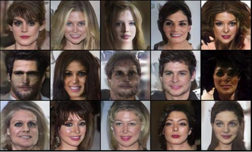

# Progressive Growing GAN (ProGAN)
A jupyter notebook based implementation of the ProGAN paper from Karras et al. This paper implemented the following:
- Progressive Growing
- Pixel Normalization
- Minibatch Standard Deviation
- Equalized Learning Rate
- Created CelebA-HQ dataset

This implementation, like the original paper, generates faces in an unsupervised manner from the CelebA-HQ dataset. Unlike the paper, images generated here are only 128x128 as opposed to 256x256 due to computational constraints.

# Results




# Citation
```
Karras, Tero, et al. "Progressive growing of gans for improved quality, stability, and variation." arXiv preprint arXiv:1710.10196 (2017).
```
